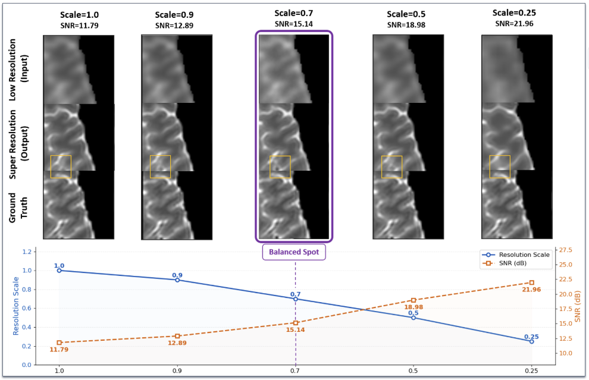
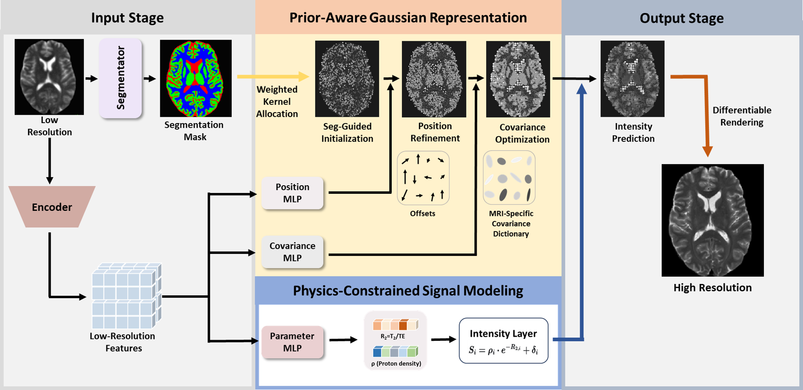
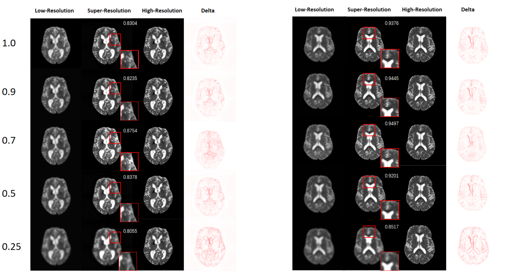

# PhyMRI-SR: Toward Physics-Aware MRI ImageSuper-Resolution
<a href='https://bio-med-i2-lab.github.io/projects/PhyMRI-SR/'></a>
<a href='https://arxiv.org/abs/2607.06238'></a>

[Lihua Wei]<sup>1</sup><sup>\*</sup>, 
[Huatong Gao]<sup>1</sup><sup>\*</sup>, 
[Jia Gong](https://scholar.google.com/citations?user=ZV-ThegAAAAJ&hl=zh-CN&oi=ao)<sup>1<sup><sup>2<sup><sup>*<sup><sup>†<sup>, 
[Zhiyu Tan](https://github.com/SAIS-FUXI)<sup>2<sup><sup>3<sup>, 
[Hao Li](https://scholar.google.com/citations?user=pHN-QIwAAAAJ&hl=zh-CN)<sup>2<sup><sup>3<sup>, 
[Jun Liu]<sup>4<sup>, 
[Zhihua Ren](https://bme.shanghaitech.edu.cn/2021/0326/c8204a1077978/page.html)<sup>1<sup><sup>5<sup><sup>†<sup>

* equal contribution # Corresponding author
* 
1 ShanghaiTech University 2 Shanghai Academy of AI for Science 3 Fudan University 4 Lancaster University 5 Shanghai Clinical Research and Trial Center
  
weilh2025@shanghaitech.edu.cn  gaoht2025@shanghaitech.edu.cn  gongjia@sais.com.cn  renzhh@shanghaitech.edu.cn
## 💡 Summary
we propose a novel 2D Gaussian splatting-based MRI super-resolution framework that accommodates dynamically varying input resolutions. We further introduce a prior-aware Gaussian parameterization module to enhance structural fidelity and a physics-constrained signal modeling module to ensure biophysically plausible intensity reconstruction. 

## 💡 Motivation and Framework

Illustration of the trade-off between spatial resolution and signal-to-noise ratio (SNR) under a simulated ultra-low MRI system(64 mT). In the high-resolution but low-SNR setting, severe noise leads to fragmented and discontinuous anatomical structures, as highlighted in the yellow boxes. The balanced regime produces more coherent and struc-turally consistent reconstructions, closely matching the HR reference. In the low-resolution high-SNR setting, structures appear over-smoothed, and fine anatomical details are lost due to partial volume effects.

Overview of the proposed physics-aware 2D GS framework. An arbitrary-resolution input is processed through two parallel pathways: a segmentator
generates tissue masks for segmentation-guided primitive allocation, while an encoder extracts LR features. Two modules subsequently estimate Gaussian
parameters: prior-aware representation predicts position offsets and selects covariance matrices from an MRI-specific dictionary, while physics-constrained
signal modeling computes intensities from tissue properties (ρ, R2) via MR signal equations. The final high-resolution output is synthesized through
differentiable splatting
## 📃 Dependencies and Installation
python 3.10

pytorch 2.10.0
```bash
pip install requirements.txt
git clone https://github.com/XingtongGe/gsplat.git
cd gsplat
pip install -e .[dev]
```

## Get Started
### Datasts
The datasets used in this study are not publicly available at this stage due to data privacy and institutional restrictions. We are currently organizing the public release of the available data resources, and the download links will be updated here once they are ready.


### Pretrained model
- Static-resolution experiments on real 64mT-3T dataset: [64mT3T_static_experiment](https://drive.google.com/file/d/15X4U_0wSmW8dtETTQPSBZmUlXCzU4nQC/view?usp=drive_link)
- Once downloaded, place the model in the designated folder, and you’ll be ready to perform inference.
  
The other pretrained model weights are not publicly released at this stage. We will update this section with download links once the model checkpoints are available for public access.


### Inference
Place all pretrained weights in "save" folders firstly. Here are  example commands for inference
```bash

#static experiments on real 64mT-3T dataset
python test.py --config configs/test/test_static.yaml --checkpoint save/static_experiment/64mT3T_static_experiment.pth
```
## Visual Examples



## ✉️ License
Licensed under a [Creative Commons Attribution-NonCommercial 4.0 International](https://creativecommons.org/licenses/by-nc/4.0/) for Non-commercial use only.
Any commercial use should get formal permission first.

### Citation

If you are interested in the following work, please cite the following paper.

```


```
